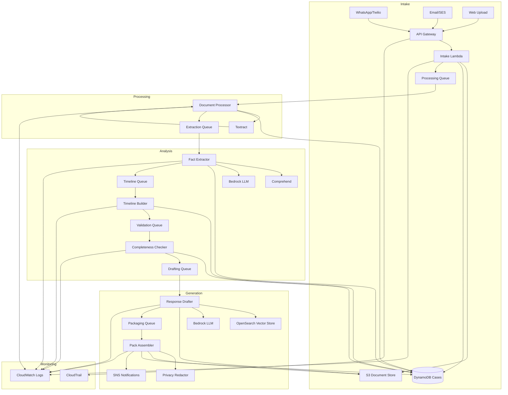

# Design Document: DisputePack AI

## Overview

DisputePack AI is an event-driven, serverless system built on AWS that automates the creation of dispute evidence packages for online merchants. The architecture follows a pipeline pattern where documents flow through intake, processing, analysis, drafting, and packaging stages. Each stage is loosely coupled through Amazon SQS queues and DynamoDB state management, enabling independent scaling and fault tolerance.

The system leverages AWS AI/ML services (Textract, Comprehend, Bedrock, OpenSearch) to extract facts, understand context, and generate policy-grounded responses. The design prioritizes reliability (retry mechanisms, dead-letter queues), auditability (CloudWatch/CloudTrail logging), and privacy compliance (PII detection and redaction).

## Architecture

### High-Level Architecture



### Component Flow

1. **Intake Stage**: API Gateway receives submissions → Intake Lambda validates, stores files in S3, creates case in DynamoDB, enqueues to Processing Queue
2. **Processing Stage**: Document Processor Lambda retrieves files from S3 → calls Textract for OCR → stores extracted text in DynamoDB → enqueues to Extraction Queue
3. **Analysis Stage**: 
   - Fact Extractor uses Comprehend for entity extraction and Bedrock for structured fact extraction → stores facts in DynamoDB → enqueues to Timeline Queue
   - Timeline Builder constructs chronological sequence → stores timeline in DynamoDB → enqueues to Validation Queue
   - Completeness Checker classifies dispute type, validates evidence against playbook → stores validation results → enqueues to Drafting Queue
4. **Generation Stage**:
   - Response Drafter queries OpenSearch for relevant policies, uses Bedrock to generate response → stores draft in S3 → enqueues to Packaging Queue
   - Pack Assembler retrieves all artifacts, applies PII redaction, creates ZIP package → stores in S3 → updates DynamoDB → sends SNS notification

### Scalability and Reliability Patterns

- **Queue-based decoupling**: Each stage communicates via SQS, enabling independent scaling and retry logic
- **Idempotent processing**: All Lambda functions check DynamoDB state before processing to handle duplicate messages
- **Dead-letter queues**: Failed messages after 3 retries move to DLQ for manual investigation
- **Exponential backoff**: Retry delays increase exponentially (1s, 2s, 4s) to handle transient failures
- **Visibility timeout**: SQS visibility timeout set to 6x expected Lambda execution time to prevent duplicate processing
- **Concurrent execution limits**: Lambda concurrency limits prevent overwhelming downstream services

## Components and Interfaces

### 1. Intake Lambda

**Responsibility**: Receive submissions from multiple channels, validate inputs, initialize case records

**Interfaces**:
- **Input**: API Gateway event (HTTP POST with multipart/form-data or JSON)
  - WhatsApp webhook: `{from, body, mediaUrl[], timestamp}`
  - Email webhook: `{from, subject, body, attachments[], receivedAt}`
  - Web upload: `{merchantId, files[], metadata}`
- **Output**: 
  - HTTP 200 with `{caseId, status: "received", estimatedCompletion}`
  - SQS message to Processing Queue: `{caseId, documentIds[], timestamp}`

**Dependencies**: S3 (file storage), DynamoDB (case creation), SQS (enqueue), Twilio API (WhatsApp), SES (email)

**Key Operations**:
- `validateFileFormat(file)`: Check file type against allowed list (PDF, JPEG, PNG, CSV, TXT)
- `validateFileSize(file)`: Reject files > 25MB
- `generateCaseId()`: Create unique case identifier (UUID v4)
- `storeDocument(file, caseId)`: Upload to S3 with key pattern `cases/{caseId}/documents/{docId}`
- `createCaseRecord(caseId, merchantId, metadata)`: Insert into DynamoDB Cases table
- `enqueueProcessing(caseId, documentIds)`: Send message to Processing Queue

### 2. Document Processor Lambda

**Responsibility**: Extract text from documents using OCR, handle various file formats

**Interfaces**:
- **Input**: SQS message from Processing Queue: `{caseId, documentIds[], timestamp}`
- **Output**: SQS message to Extraction Queue: `{caseId, extractedTexts[], metadata}`

**Dependencies**: S3 (file retrieval), Textract (OCR), DynamoDB (state update), SQS (enqueue)

**Key Operations**:
- `retrieveDocument(documentId)`: Fetch file from S3
- `detectDocumentType(file)`: Identify if image, PDF, or text
- `extractTextFromImage(image)`: Call Textract DetectDocumentText API
- `extractTextFromPDF(pdf)`: Call Textract AnalyzeDocument API with TABLES and FORMS features
- `parseTextFile(file)`: Read plain text directly
- `storeExtractedText(caseId, documentId, text)`: Save to DynamoDB Documents table
- `updateCaseStatus(caseId, status)`: Update case processing state

### 3. Fact Extractor Lambda

**Responsibility**: Extract structured facts from text using NLP and LLM

**Interfaces**:
- **Input**: SQS message from Extraction Queue: `{caseId, extractedTexts[], metadata}`
- **Output**: SQS message to Timeline Queue: `{caseId, facts[], timestamp}`

**Dependencies**: Comprehend (entity extraction, PII detection), Bedrock (structured extraction), DynamoDB (fact storage), SQS (enqueue)

**Key Operations**:
- `extractEntities(text)`: Call Comprehend DetectEntities to find dates, amounts, names, locations
- `extractPII(text)`: Call Comprehend DetectPiiEntities to identify sensitive data
- `structuredExtraction(text, schema)`: Use Bedrock with prompt template to extract facts into JSON schema
  - Schema: `{orderNumber, transactionId, orderDate, amount, trackingNumber, deliveryDate, customerName, customerStatement, merchantAction}`
- `mergeFacts(facts[])`: Combine facts from multiple documents, resolve conflicts
- `storeFacts(caseId, facts)`: Save to DynamoDB Facts table

### 4. Timeline Builder Lambda

**Responsibility**: Construct chronological event sequence from extracted facts

**Interfaces**:
- **Input**: SQS message from Timeline Queue: `{caseId, facts[], timestamp}`
- **Output**: SQS message to Validation Queue: `{caseId, timeline[], timestamp}`

**Dependencies**: DynamoDB (timeline storage), SQS (enqueue)

**Key Operations**:
- `parseTimestamps(facts)`: Extract and normalize all date/time values
- `inferEventOrder(events)`: Apply logical ordering rules when timestamps missing
  - Order: order_placed → payment_received → order_shipped → order_delivered → complaint_received → merchant_action
- `constructTimeline(events)`: Build chronological sequence with event type, timestamp, description, source document
- `generateVisualTimeline(timeline)`: Create one-page HTML/PDF visualization
- `storeTimeline(caseId, timeline)`: Save to DynamoDB Timeline table

### 5. Completeness Checker Lambda

**Responsibility**: Classify dispute type, validate evidence against playbook requirements

**Interfaces**:
- **Input**: SQS message from Validation Queue: `{caseId, timeline[], facts[], timestamp}`
- **Output**: SQS message to Drafting Queue: `{caseId, disputeType, missingEvidence[], readyForDraft, timestamp}`

**Dependencies**: DynamoDB (validation results), SQS (enqueue), Bedrock (classification)

**Key Operations**:
- `classifyDisputeType(facts, timeline)`: Use Bedrock with few-shot examples to classify into Item_Not_Received, Not_As_Described, Unauthorized_Fraud, Refund_Not_Processed
- `getPlaybook(disputeType)`: Retrieve evidence requirements for dispute type
  - Item_Not_Received: [proof_of_delivery, tracking_info, shipping_confirmation]
  - Not_As_Described: [product_listing, product_images, customer_communication]
  - Unauthorized_Fraud: [transaction_authorization, ip_logs, delivery_confirmation]
  - Refund_Not_Processed: [refund_transaction, refund_policy]
- `validateEvidence(facts, playbook)`: Check if required evidence present
- `identifyMissingEvidence(facts, playbook)`: Generate list of missing items with descriptions
- `calculateConfidence(classification)`: Compute confidence score for dispute type
- `flagForReview(caseId, reasons)`: Mark case for human review if confidence < 80% or amount > $1000
- `storeValidation(caseId, results)`: Save to DynamoDB Validation table

### 6. Response Drafter Lambda

**Responsibility**: Generate policy-grounded dispute response using RAG pattern

**Interfaces**:
- **Input**: SQS message from Drafting Queue: `{caseId, disputeType, facts[], timeline[], timestamp}`
- **Output**: SQS message to Packaging Queue: `{caseId, responseLetter, timestamp}`

**Dependencies**: OpenSearch (policy retrieval), Bedrock (text generation, embeddings), S3 (response storage), DynamoDB (draft metadata), SQS (enqueue)

**Key Operations**:
- `generateQueryEmbedding(disputeType, facts)`: Use Bedrock Embeddings to create vector representation
- `retrieveRelevantPolicies(embedding)`: Query OpenSearch vector store for similar policy documents
- `constructPrompt(facts, timeline, policies, disputeType)`: Build LLM prompt with context
  - Template: "You are writing a dispute response for {disputeType}. Facts: {facts}. Timeline: {timeline}. Relevant policies: {policies}. Write a professional response with sections: Introduction, Facts, Evidence Summary, Conclusion. Reference specific evidence for each claim."
- `generateResponse(prompt)`: Call Bedrock LLM (Claude 3 Sonnet) with temperature=0.3 for consistency
- `validateResponseStructure(response)`: Ensure all required sections present
- `addEvidenceReferences(response, facts)`: Link each claim to specific exhibit numbers
- `storeResponse(caseId, response)`: Save to S3 with key `cases/{caseId}/response.txt`

### 7. Pack Assembler Lambda

**Responsibility**: Create complete evidence package with redaction, labeling, and packaging

**Interfaces**:
- **Input**: SQS message from Packaging Queue: `{caseId, responseLetter, timestamp}`
- **Output**: SNS notification: `{caseId, packageUrl, status: "ready", timestamp}`

**Dependencies**: S3 (artifact retrieval/storage), DynamoDB (case update), Comprehend (PII detection), SNS (notification)

**Key Operations**:
- `retrieveArtifacts(caseId)`: Fetch response letter, timeline, all documents from S3
- `detectPII(documents)`: Use Comprehend DetectPiiEntities on all documents
- `redactPII(document, piiEntities)`: Replace sensitive data with masked values (e.g., "****-****-****-1234")
- `generateExhibitIndex(documents)`: Create numbered list with descriptions and page counts
- `labelDocuments(documents)`: Rename files with exhibit numbers (Exhibit_A_Invoice.pdf)
- `createSubmissionChecklist(disputeType)`: Generate checklist confirming all required components
- `packageFiles(files)`: Create ZIP archive with structure:
  ```
  evidence_pack_{caseId}.zip
  ├── response_letter.pdf
  ├── timeline.pdf
  ├── exhibit_index.pdf
  ├── submission_checklist.pdf
  └── exhibits/
      ├── Exhibit_A_Invoice.pdf
      ├── Exhibit_B_Tracking.pdf
      └── ...
  ```
- `uploadPackage(caseId, zipFile)`: Store in S3 with key `cases/{caseId}/evidence_pack.zip`
- `generatePresignedUrl(packageKey)`: Create temporary download URL (expires in 7 days)
- `updateCaseStatus(caseId, status: "completed")`: Mark case as ready
- `sendNotification(merchantId, caseId, packageUrl)`: Publish to SNS topic for merchant notification

### 8. API Gateway Endpoints

**Endpoints**:

1. **POST /intake/whatsapp**
   - Handler: Intake Lambda
   - Auth: Twilio signature verification
   - Body: Twilio webhook payload
   - Response: 200 OK (Twilio requires immediate response)

2. **POST /intake/email**
   - Handler: Intake Lambda
   - Auth: SES verification
   - Body: SES notification payload
   - Response: 200 OK

3. **POST /intake/upload**
   - Handler: Intake Lambda
   - Auth: API key or JWT
   - Body: multipart/form-data with files and metadata
   - Response: `{caseId, status, estimatedCompletion}`

4. **GET /cases/{caseId}**
   - Handler: Query Lambda (not shown in main flow)
   - Auth: API key or JWT
   - Response: `{caseId, status, disputeType, createdAt, updatedAt, packageUrl?}`

5. **GET /cases**
   - Handler: Query Lambda
   - Auth: API key or JWT
   - Query params: `merchantId`, `status`, `limit`, `nextToken`
   - Response: `{cases[], nextToken?}`

6. **POST /cases/{caseId}/review**
   - Handler: Review Lambda (not shown in main flow)
   - Auth: API key or JWT
   - Body: `{action: "approve" | "reject" | "modify", modifications?}`
   - Response: `{caseId, status, updatedAt}`

## Data Models

### DynamoDB Tables

#### Cases Table

**Primary Key**: `caseId` (String, Partition Key)

**Attributes**:
```json
{
  "caseId": "uuid-v4",
  "merchantId": "string",
  "status": "received | processing | extraction | timeline | validation | drafting | packaging | ready | failed",
  "disputeType": "Item_Not_Received | Not_As_Described | Unauthorized_Fraud | Refund_Not_Processed | null",
  "classificationConfidence": "number (0-1)",
  "flaggedForReview": "boolean",
  "reviewReasons": ["string"],
  "createdAt": "ISO8601 timestamp",
  "updatedAt": "ISO8601 timestamp",
  "submissionDeadline": "ISO8601 timestamp",
  "packageUrl": "string (S3 presigned URL)",
  "metadata": {
    "channel": "whatsapp | email | web",
    "documentCount": "number",
    "disputeAmount": "number"
  }
}
```

**GSI**: `merchantId-createdAt-index` (for querying merchant's cases)

#### Documents Table

**Primary Key**: `documentId` (String, Partition Key)

**Sort Key**: `caseId` (String)

**Attributes**:
```json
{
  "documentId": "uuid-v4",
  "caseId": "string",
  "s3Key": "string",
  "fileName": "string",
  "fileType": "pdf | jpeg | png | csv | txt",
  "fileSize": "number (bytes)",
  "extractedText": "string (large text)",
  "ocrConfidence": "number (0-1)",
  "uploadedAt": "ISO8601 timestamp",
  "processedAt": "ISO8601 timestamp"
}
```

**GSI**: `caseId-uploadedAt-index` (for retrieving all documents for a case)

#### Facts Table

**Primary Key**: `caseId` (String, Partition Key)

**Attributes**:
```json
{
  "caseId": "string",
  "facts": {
    "orderNumber": "string",
    "transactionId": "string",
    "orderDate": "ISO8601 timestamp",
    "amount": "number",
    "currency": "string",
    "trackingNumber": "string",
    "carrier": "string",
    "shippedDate": "ISO8601 timestamp",
    "deliveryDate": "ISO8601 timestamp",
    "deliveryStatus": "delivered | in_transit | failed | null",
    "recipientName": "string",
    "signatureStatus": "signed | unsigned | null",
    "customerName": "string",
    "customerEmail": "string",
    "customerStatement": "string",
    "complaintDate": "ISO8601 timestamp",
    "merchantActions": ["string"],
    "refundAmount": "number",
    "refundDate": "ISO8601 timestamp"
  },
  "sourceDocuments": {
    "orderNumber": "documentId",
    "trackingNumber": "documentId",
    ...
  },
  "extractedAt": "ISO8601 timestamp"
}
```

#### Timeline Table

**Primary Key**: `caseId` (String, Partition Key)

**Attributes**:
```json
{
  "caseId": "string",
  "events": [
    {
      "eventType": "order_placed | payment_received | order_shipped | order_delivered | complaint_received | merchant_action | refund_issued",
      "timestamp": "ISO8601 timestamp",
      "description": "string",
      "sourceDocument": "documentId",
      "confidence": "high | medium | low"
    }
  ],
  "visualTimelineUrl": "string (S3 URL)",
  "createdAt": "ISO8601 timestamp"
}
```

#### Validation Table

**Primary Key**: `caseId` (String, Partition Key)

**Attributes**:
```json
{
  "caseId": "string",
  "disputeType": "string",
  "classificationConfidence": "number (0-1)",
  "requiredEvidence": ["string"],
  "presentEvidence": ["string"],
  "missingEvidence": [
    {
      "item": "string",
      "description": "string",
      "criticality": "required | recommended"
    }
  ],
  "isComplete": "boolean",
  "validatedAt": "ISO8601 timestamp"
}
```

### S3 Bucket Structure

```
disputepack-documents/
├── cases/
│   ├── {caseId}/
│   │   ├── documents/
│   │   │   ├── {documentId}.pdf
│   │   │   ├── {documentId}.jpg
│   │   │   └── ...
│   │   ├── response.txt
│   │   ├── timeline.pdf
│   │   ├── evidence_pack.zip
│   │   └── redaction_log.json
│   └── ...
└── policies/
    ├── merchant_policies/
    │   ├── return_policy.txt
    │   ├── shipping_policy.txt
    │   └── ...
    └── platform_guidelines/
        ├── stripe_dispute_guide.txt
        ├── paypal_chargeback_rules.txt
        └── ...
```

### OpenSearch Index Schema

**Index**: `dispute-policies`

**Mapping**:
```json
{
  "mappings": {
    "properties": {
      "policyId": {"type": "keyword"},
      "policyType": {"type": "keyword"},
      "disputeType": {"type": "keyword"},
      "content": {"type": "text"},
      "embedding": {
        "type": "knn_vector",
        "dimension": 1536,
        "method": {
          "name": "hnsw",
          "engine": "nmslib"
        }
      },
      "source": {"type": "keyword"},
      "lastUpdated": {"type": "date"}
    }
  }
}
```

### SQS Message Schemas

**Processing Queue Message**:
```json
{
  "caseId": "string",
  "documentIds": ["string"],
  "timestamp": "ISO8601 timestamp",
  "retryCount": "number"
}
```

**Extraction Queue Message**:
```json
{
  "caseId": "string",
  "extractedTexts": [
    {
      "documentId": "string",
      "text": "string",
      "confidence": "number"
    }
  ],
  "timestamp": "ISO8601 timestamp"
}
```

**Timeline Queue Message**:
```json
{
  "caseId": "string",
  "facts": "object (Facts schema)",
  "timestamp": "ISO8601 timestamp"
}
```

**Validation Queue Message**:
```json
{
  "caseId": "string",
  "timeline": "array (Timeline events)",
  "facts": "object (Facts schema)",
  "timestamp": "ISO8601 timestamp"
}
```

**Drafting Queue Message**:
```json
{
  "caseId": "string",
  "disputeType": "string",
  "facts": "object",
  "timeline": "array",
  "missingEvidence": "array",
  "readyForDraft": "boolean",
  "timestamp": "ISO8601 timestamp"
}
```

**Packaging Queue Message**:
```json
{
  "caseId": "string",
  "responseLetter": "string (S3 key)",
  "timestamp": "ISO8601 timestamp"
}
```

